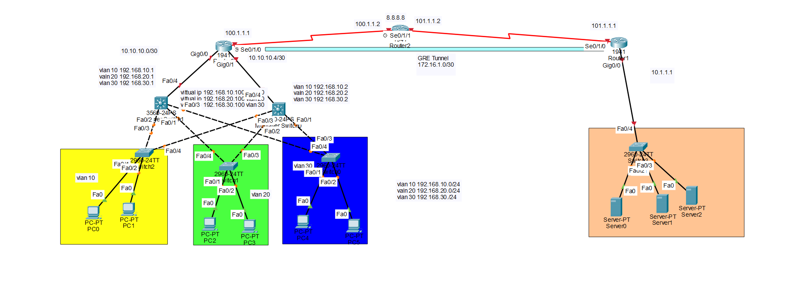

# Enterprise-Network-Project
Enterprise Network Project using packet tracaer  
## Network Topology

This project implements the following networking technologies and protocols:

* **VLANs** – Network segmentation and logical separation based on physical location
* **DTP (Dynamic Trunking Protocol)** – Dynamic trunk link negotiation
* **High Availability – HSRP**
* **Dynamic Routing Protocol – OSPF**
* **NAT – PAT Overloading**
* **VPN** – Secure communication between networks using GRE
* **3-Tier Architecture**

